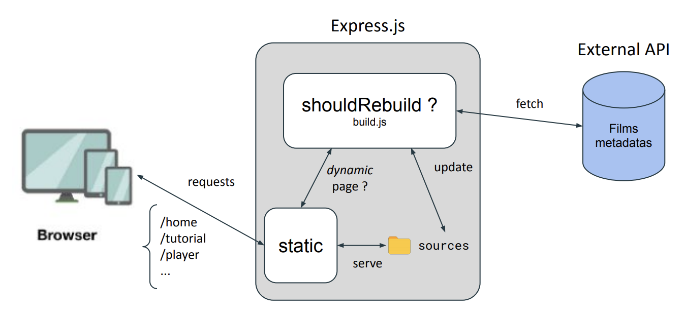

<!-- PROJECT LOGO -->
<br />
<p align="center">
  <a href="https://github.com/cchanche/esp32iot">
    
  </a>

  <h3 align="center">GreenIT and Eco design Principles</h3>
  <h5 align="center"><i>Clément CHANCHEVRIER</br>Elian EGRETEAU</br>Samuel BOURY</br>Loïc BESSE</i></h4>
</p>

## About

Initiated by _Accenture_, the project was meant to bring to the light how we could design or re-design a webpage in order to reduce it's ecological impact. We achieved it by designing two separate apps : a standard one and an eco-friendly one. For convenience, we called them respectively `hightech` and `lowtech`. We defined a business case that would be as harmfull as possible for the environnement, but also not too fancy. We went for a streaming app like _Netflix_ of _Prime_.

**We do not maintain any of this anymore, if you want to use the code feel free to fork.**

---

# Getting started

If you just want to take a look at our work here is how :

## Installation

In order to run any of the two web sites you need the following installed on your machine :

- NodeJS : follow the [official guide](https://nodejs.org/en/) for your operating system.
- Clone the repository on your machine.

In order to run the `hightech` website, you will need a local (or distant) mongoDB database. [Here is how to install and run mongodb server](https://docs.mongodb.com/manual/installation/) (Choose the MongoDB Community Edition Installation Tutorial referring to your OS & follow the _install_ and _run_ sections).

- Open a terminal in the following locations :
  - `./lowtech` and run `npm i && npm start`
  - `./hightech` and run `npm i && npm run build`
  - `./hightech-server` and run `npm i && npm start`

If everything runs smoothly, you will be able to use the `lowtech` website at [localhost:3000](localhost:3000) and the `hightech` at [localhost:8000](localhost:8000).

# Maintaining

If you want to re-use our code or if you are just curious about more technical insights, here is a quick guide about our delevoppement process.

**Keep in mind we were a team of beginners in web developpement and under time pressure : be indulgent and feel free to ask anything, we might still be around to answer.**

## Lowtech

Our goal here was to match as close as possible a static website. Static pages don't involve any processing power from the server nor the device, which was obviously the goal for an eco-friendly page.

# Server
We went with a NodeJS server (using express) in order to compensate for the lack of front-end javascript we wanted to avoid.

<p align="center">
    
</p>

On startup, the server asks the static sources to build themselves once.

```javascript
// server/index.js

const buildPublic = require("../src/build");
```

This build the `public` folder which contains all _.html_ and _.css_ files to run our website.

In addition, to manage the dynamical side of our website, an asynchronous function (```javascript genHtml``` specified in `src/index.js`) is called each time the  website user asks for a dynamical content (to generate the html files according to this request and store them in the `public` folder).

Express simply serve all these files located in the `public` folder.

```javascript
// server/index.js

app.use(express.static("../public"));
```

# Movies
To recover the information on movies, we used the online API _The Movie Database API_ available [here](https://developers.themoviedb.org/3/getting-started/introduction).
To simplify our project (to avoid a database management in particular), we decided not to store the whole movies (video files) available on the api. We only stored a unique movie on server.

## Hightech
